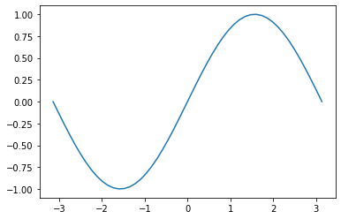

<!-- markdownlint-disable MD009 MD012 MD046 -->

```python
import tasks
```


```python
tasks.try_import_matplotlib()
```

    success: import matplotlib


```python
import matplotlib.pyplot as plt
import numpy as np
```


```python
x = np.linspace(-np.pi, np.pi, 50)
y = np.sin(x)
plt.plot(x,y)
```


    [<matplotlib.lines.Line2D at 0x142a46580>]


    

    

<!-- markdownlint-enable MD009 MD012 MD046 -->