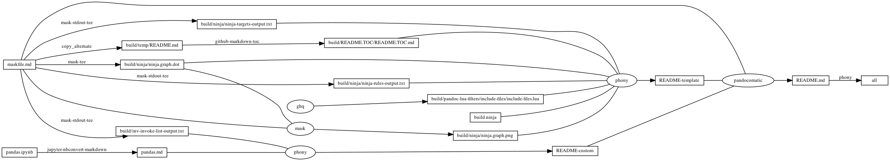

---
pandocomatic_:
    pandoc:
        from: markdown-smart
        to: gfm
        filter:
        - pandoc-include-code
        lua-filter:
        - ./build/pandoc-lua-filters/include-files/include-files.lua
        output: README.md
...

# jupyterlab-pandas

<!-- markdownlint-disable MD007 MD030 -->
```{.include}
./build/README.TOC/README.TOC.md
```
<!-- markdownlint-enable MD007 MD030 -->

# tasks.py

[tasks.py](./tasks.py)

```{.python include=./tasks.py snippet=try_import_pandas}
```

# pandas.ipynb

[pandas.ipynb](/pandas.ipynb)

```{.include}
./pandas.md
```

# Mask SubCommands

[Mask Awesome](https://github.com/huzhenghui/mask-awesome)

## inv-invoke-list

```bash
inv invoke-list
```

### def `invoke_list`

```{.python include=./tasks.py snippet=invoke_list}
```

### inv-invoke-list-output

```{.plain include=./build/inv-invoke-list-output.txt}
```

## inv-auto-install-pandas

```bash
inv auto-install-pandas
```

### def `auto_install_pandas`

```{.python include=./tasks.py snippet=auto_install_pandas}
```

## begin: mask task in template : build content

## ninja-rules

```bash
ninja -t rules
```

### ninja custom-rule

```{.ninja include=build.ninja snippet=custom-rule}
```

### ninja-rules-output

```{.plain include=./build/ninja/ninja-rules-output.txt}
```

## ninja-targets

```bash
ninja -t targets all
```

### ninja build-all

```{.ninja include=build.ninja snippet=build-all}
```

### ninja custom-build

```{.ninja include=build.ninja snippet=custom-build}

```

### ninja report-build

```{.ninja include=build.ninja snippet=report-build}

```

### ninja-targets-output

```{.plain include=./build/ninja/ninja-targets-output.txt}
```

## readme-md

```bash
ninja --verbose README.md
```

### ninja readme-build

```{.ninja include=build.ninja snippet=custom-readme-build}
```

```{.ninja include=build.ninja snippet=readme-build}
```

## end: mask task in template : build content

## begin: mask task in template : ninja command

## ninja-browse

```bash
ninja -t browse
```

## ninja-graph-png

```bash
dot -Tpng -o./build/ninja/ninja.graph.png ./build/ninja/ninja.graph.dot
```



## ninja-graph-dot-xdot

```bash
detach -- xdot "${MASKFILE_DIR}/build/ninja/ninja.graph.dot"
```

## ninja-graph-dot

```bash
ninja -t graph
```

### ninja-graph-dot-output

```{.dot include=./build/ninja/ninja.graph.dot}
```

## ninja-all

```bash
ninja --verbose
```

### build.ninja

```{.ninja include=./build.ninja}
```

## end: mask task in template : ninja command
