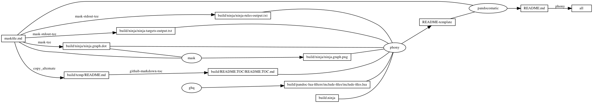

# jupyterlab-pre-commit

<!-- markdownlint-disable MD007 MD030 -->

-   [jupyterlab-pre-commit](#jupyterlab-pre-commit)
-   [.pre-commit-config.yaml](#pre-commit-configyaml)
-   [Mask SubCommands](#mask-subcommands)
    -   [begin: mask task in template : build
        content](#begin-mask-task-in-template--build-content)
    -   [ninja-rules](#ninja-rules)
        -   [ninja custom-rule](#ninja-custom-rule)
        -   [ninja-rules-output](#ninja-rules-output)
    -   [ninja-targets](#ninja-targets)
        -   [ninja build-all](#ninja-build-all)
        -   [ninja custom-build](#ninja-custom-build)
        -   [ninja report-build](#ninja-report-build)
        -   [ninja-targets-output](#ninja-targets-output)
    -   [readme-md](#readme-md)
        -   [ninja readme-build](#ninja-readme-build)
    -   [end: mask task in template : build
        content](#end-mask-task-in-template--build-content)
    -   [begin: mask task in template : ninja
        command](#begin-mask-task-in-template--ninja-command)
    -   [ninja-browse](#ninja-browse)
    -   [ninja-graph-png](#ninja-graph-png)
    -   [ninja-graph-dot-xdot](#ninja-graph-dot-xdot)
    -   [ninja-graph-dot](#ninja-graph-dot)
        -   [ninja-graph-dot-output](#ninja-graph-dot-output)
    -   [ninja-all](#ninja-all)
        -   [build.ninja](#buildninja)
    -   [end: mask task in template : ninja
        command](#end-mask-task-in-template--ninja-command)

<!-- markdownlint-enable MD007 MD030 -->

# `.pre-commit-config.yaml`

<!-- markdownlint-disable MD013 -->

[.pre-commit-config.yaml](https://github.com/huzhenghui/python-awesome/blob/master/.pre-commit-config.yaml)
<!-- markdownlint-enable MD013 -->

``` yaml
      - id: jupyter-nb-clear-output
        name: jupyter-nb-clear-output
        files: \.ipynb$
        exclude: \.output\.ipynb$
        stages: [commit]
        language: system
        entry: jupyter nbconvert --ClearOutputPreprocessor.enabled=True --inplace
```

# Mask SubCommands

[Mask Awesome](https://github.com/huzhenghui/mask-awesome)

## begin: mask task in template : build content

## ninja-rules

``` bash
ninja -t rules
```

### ninja custom-rule

``` ninja
# custom rule here

```

### ninja-rules-output

``` plain
copy_alternate
ghq
github-markdown-toc
mask
mask-man-markdown
mask-screenshot
mask-stderr-tee
mask-stdout-csv-markdown
mask-stdout-tee
mask-tee
pandocomatic
phony
```

## ninja-targets

``` bash
ninja -t targets all
```

### ninja build-all

``` ninja
build all: phony README.md

default all

```

### ninja custom-build

``` ninja
# custom build here

```

### ninja report-build

``` ninja
# report build here

```

### ninja-targets-output

``` plain
all: phony
build/pandoc-lua-filters/include-files/include-files.lua: ghq
build/ninja/ninja-rules-output.txt: mask-stdout-tee
build/ninja/ninja-targets-output.txt: mask-stdout-tee
build/ninja/ninja.graph.dot: mask-tee
build/ninja/ninja.graph.png: mask
build/temp/README.md: copy_alternate
build/README.TOC/README.TOC.md: github-markdown-toc
README-template: phony
README.md: pandocomatic
```

## readme-md

``` bash
ninja --verbose README.md
```

### ninja readme-build

``` ninja
# readme build here

```

``` ninja
build README.md : pandocomatic maskfile.md | README-template

```

## end: mask task in template : build content

## begin: mask task in template : ninja command

## ninja-browse

``` bash
ninja -t browse
```

## ninja-graph-png

``` bash
dot -Tpng -o./build/ninja/ninja.graph.png ./build/ninja/ninja.graph.dot
```



## ninja-graph-dot-xdot

``` bash
detach -- xdot "${MASKFILE_DIR}/build/ninja/ninja.graph.dot"
```

## ninja-graph-dot

``` bash
ninja -t graph
```

### ninja-graph-dot-output

``` dot
digraph ninja {
rankdir="LR"
node [fontsize=10, shape=box, height=0.25]
edge [fontsize=10]
"0x7fefdb507510" [label="all"]
"0x7fefdb5079a0" -> "0x7fefdb507510" [label=" phony"]
"0x7fefdb5079a0" [label="README.md"]
"0x7fefdb508ab0" [label="pandocomatic", shape=ellipse]
"0x7fefdb508ab0" -> "0x7fefdb5079a0"
"0x7fefdb5080d0" -> "0x7fefdb508ab0" [arrowhead=none]
"0x7fefdb508a50" -> "0x7fefdb508ab0" [arrowhead=none]
"0x7fefdb5080d0" [label="maskfile.md"]
"0x7fefdb508a50" [label="README-template"]
"0x7fefdb508b30" [label="phony", shape=ellipse]
"0x7fefdb508b30" -> "0x7fefdb508a50"
"0x7fefdb507e10" -> "0x7fefdb508b30" [arrowhead=none]
"0x7fefdb508e60" -> "0x7fefdb508b30" [arrowhead=none]
"0x7fefdb508010" -> "0x7fefdb508b30" [arrowhead=none]
"0x7fefdb508280" -> "0x7fefdb508b30" [arrowhead=none]
"0x7fefdb5084e0" -> "0x7fefdb508b30" [arrowhead=none]
"0x7fefdb5086f0" -> "0x7fefdb508b30" [arrowhead=none]
"0x7fefdb5089f0" -> "0x7fefdb508b30" [arrowhead=none]
"0x7fefdb507e10" [label="build/pandoc-lua-filters/include-files/include-files.lua"]
"0x7fefdb507da0" [label="ghq", shape=ellipse]
"0x7fefdb507da0" -> "0x7fefdb507e10"
"0x7fefdb508e60" [label="build.ninja"]
"0x7fefdb508010" [label="build/ninja/ninja-rules-output.txt"]
"0x7fefdb5080d0" -> "0x7fefdb508010" [label=" mask-stdout-tee"]
"0x7fefdb508280" [label="build/ninja/ninja-targets-output.txt"]
"0x7fefdb5080d0" -> "0x7fefdb508280" [label=" mask-stdout-tee"]
"0x7fefdb5084e0" [label="build/ninja/ninja.graph.dot"]
"0x7fefdb5080d0" -> "0x7fefdb5084e0" [label=" mask-tee"]
"0x7fefdb5086f0" [label="build/ninja/ninja.graph.png"]
"0x7fefdb508680" [label="mask", shape=ellipse]
"0x7fefdb508680" -> "0x7fefdb5086f0"
"0x7fefdb5080d0" -> "0x7fefdb508680" [arrowhead=none]
"0x7fefdb5084e0" -> "0x7fefdb508680" [arrowhead=none]
"0x7fefdb5089f0" [label="build/README.TOC/README.TOC.md"]
"0x7fefdb508880" -> "0x7fefdb5089f0" [label=" github-markdown-toc"]
"0x7fefdb508880" [label="build/temp/README.md"]
"0x7fefdb5080d0" -> "0x7fefdb508880" [label=" copy_alternate"]
}
```



## ninja-all

``` bash
ninja --verbose
```

### build.ninja

``` ninja
builddir=./build
mask_subcommand = --help
mask_stdout_csv_markdowndelimiter = ","

#######################################
# begin: rule in template

rule mask
  command = mask --maskfile $in $mask_subcommand

rule mask-tee
  command = mask --maskfile $in $mask_subcommand 2>&1 | tee $out 1> /dev/null

rule mask-stdout-tee
  command = mask --maskfile $in $mask_subcommand 2>/dev/null | tee $out 1> /dev/null

rule mask-stderr-tee
  command = bash -c 'mask $mask_subcommand 1>/dev/null 2> >(tee $out)'

# <!-- markdownlint-disable MD013 -->
rule mask-man-markdown
  command = mask --maskfile $in $mask_subcommand | $
    ul | $
    ansifilter --bbcode | $
    inv --search-root="$$(ghq list --full-path https://github.com/huzhenghui/pyinvoke-awesome)/bbcode" bbcode-parser-format | $
    pandoc --from=html --to=markdown | $
    tee $out 1> /dev/null
# <!-- markdownlint-enable MD013 -->

rule mask-stdout-csv-markdown
  command = mask --maskfile $in $mask_subcommand 2>/dev/null | $
    csvtomd --delimiter "$$(echo $mask_stdout_csv_markdowndelimiter)" | $
    tee $out 1> /dev/null

rule mask-screenshot
  command = $
    regular_logfile="./build/temp/$$(basename $out).mask-screenshot.logfile" && $
    rm -f -v "$${regular_logfile}" && $
    until [[ -s "$${regular_logfile}" ]]; do $
      screen_logfile="$$(mktemp -d)/logfile"; $
      echo "$${screen_logfile}"; $
      mkfifo "$${screen_logfile}"; $
      screen -L -Logfile "$${screen_logfile}" $
        -dmS mask-screenshot-"$$(basename $out)" $
        sh -c "stdbuf -o0 mask --maskfile $in $mask_subcommand; $
          date +'%F %T %Z %z - %+ https://github.com/huzhenghui' | lolcat;"; $
      dd bs=1 if="$${screen_logfile}" of="$${regular_logfile}"; $
    done && $
    ansifilter --html --encoding=utf8 --input="$${regular_logfile}" | $
      tee ./build/temp/"$$(basename $out)".mask-screenshot.html | $
      wkhtmltoimage --format png - "$out"

rule pandocomatic
  command = pandocomatic --input $in --output $out

rule ghq
  command = ghq get --update "$repository" && $
    find -d "$link_dirname" -exec rmdir {} \; && $
    ln -Fs "$$(ghq list --full-path $repository)" "$link_dirname"
  generator = 1

rule github-markdown-toc
  command = gh-md-toc --hide-header --hide-footer --no-escape $in > $out

rule copy_alternate
  command = if [[ -f "$alternate" ]]; $
    then $
      cp "$alternate" "$out"; $
    else $
      cp "$in" "$out"; $
    fi;

# end: rule in template
#######################################

#######################################
# start snippet custom-rule

# custom rule here

# end snippet custom-rule
#######################################

#######################################
# start snippet build-all

build all: phony README.md

default all

# end snippet build-all
#######################################

#######################################
# start snippet custom-build

# custom build here

# end snippet custom-build
#######################################

#######################################
# start snippet report-build

# report build here

# end snippet report-build
#######################################

#######################################
# begin: readme-build in template

build ./build/pandoc-lua-filters/include-files/include-files.lua : ghq
  repository = https://github.com/pandoc/lua-filters
  link_dirname = ./build/pandoc-lua-filters

build ./build/ninja/ninja-rules-output.txt : mask-stdout-tee ./maskfile.md
  mask_subcommand = ninja-rules

build ./build/ninja/ninja-targets-output.txt : mask-stdout-tee ./maskfile.md
  mask_subcommand = ninja-targets

build ./build/ninja/ninja.graph.dot : mask-tee ./maskfile.md
  mask_subcommand = ninja-graph-dot

build ./build/ninja/ninja.graph.png : mask ./maskfile.md | ./build/ninja/ninja.graph.dot
  mask_subcommand = ninja-graph-png

build ./build/temp/README.md : copy_alternate ./maskfile.md
  alternate = ./README.md

build ./build/README.TOC/README.TOC.md : github-markdown-toc ./build/temp/README.md

build README-template : phony $
  ./build/pandoc-lua-filters/include-files/include-files.lua $
  ./build.ninja $
  ./build/ninja/ninja-rules-output.txt $
  ./build/ninja/ninja-targets-output.txt $
  ./build/ninja/ninja.graph.dot $
  ./build/ninja/ninja.graph.png $
  ./build/README.TOC/README.TOC.md $

# end: readme-build in template
#######################################

#######################################
# start snippet custom-readme-build

# readme build here

# end snippet custom-readme-build
#######################################

#######################################
# $ followed by a newline
# escape the newline (continue the current line across a line break).
# start snippet readme-build

build README.md : pandocomatic maskfile.md | README-template

# end snippet readme-build
#######################################
```

## end: mask task in template : ninja command
